# Smart Home Automation - Web Version

<a href="https://github.com/roysaurabh1308/Smart-Home-Web-Version-1.0" target="_blank">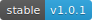</a>
<a href="https://github.com/roysaurabh1308/Smart-Home-Web-Version-1.0/blob/master/Final%20Report%20PPT%20and%20Android%20App/Smart%20Home%20App.apk" target="_blank">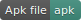<a>
<a href="LICENSE" target="_blank"><a>
 

## About
Internet of Things (IoT) conceptualizes the idea of remotely connecting and monitoring real world objects (things) through the Internet. When it comes to our house, this concept can be aptly incorporated to make it smarter, safer and automated. Smart Home is an IoT based project that focuses on building a fully automated home with surveillance (using facial recognition system), which will send alerts to the owner in case of any trespass. You can control and monitor all your home appliances like bulbs, fans, AC, geyser, etc. by just a click of a button or sending voice commands via. our Android and Web Application. To ensure the safety of the house, the system will continously process the camera frames for the motion detection and facial recognition. In case of any tresspassing or any other unusual activity, the system will instantly notify the user (viz. - User can view the face pic of the intruder or can view the live video stream from the camera).

## Demo WebApp
<a href="https://www.myhomecare.tech/" target="_blank">**myhomecare.tech**</a>
 
<a href="https://youtu.be/iZ7Uie13FFM" target="_blank">**Video**</a>

## Features
-	Through web technology and mobile application for controlling and monitoring. User can control any appliance in the Home.
-	User can operate through mobile app and dashboard switch and also monitor using website by a distant.
-	The security surveillance can be achieved using facial recognition & motion detection.

## Security 
- Login details and device id verification to **avoid fraud and Spamming.**
- **Notification Alert** if unusual activity detected.
- Allows **single device login** per id at time.
- **End-to-End encryption.**

# Screenshots #

|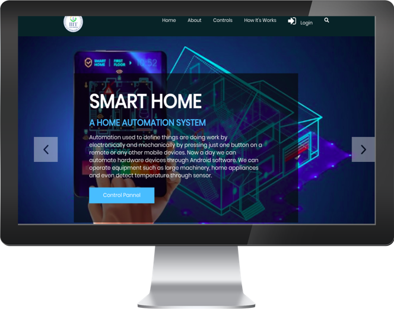|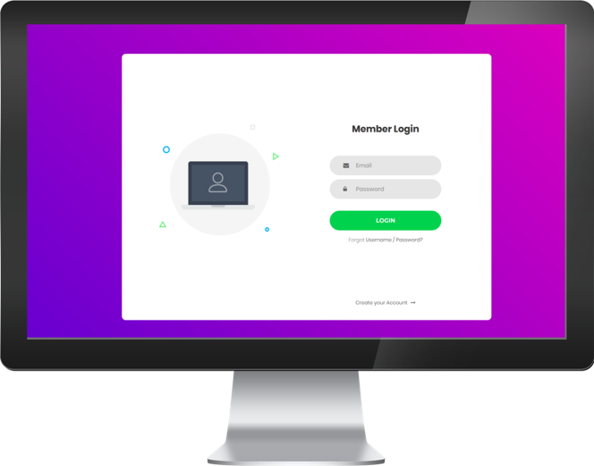|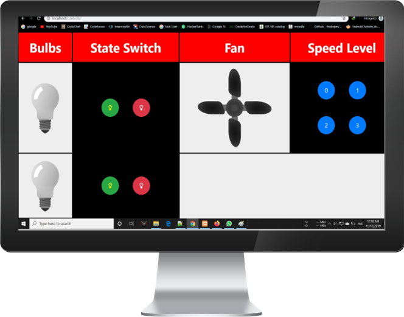|
|:--:|:--:|:--:|
|**Splashscreen**|**Login Panel**|**Dashboard**|

|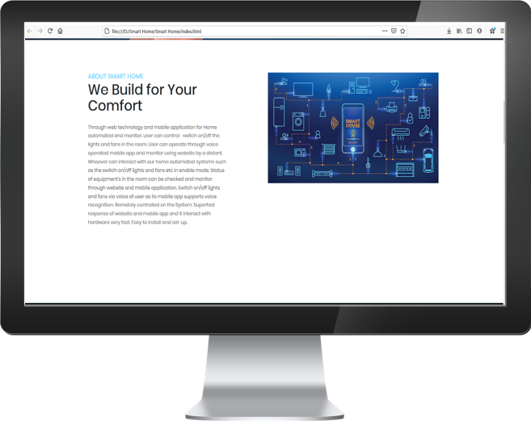|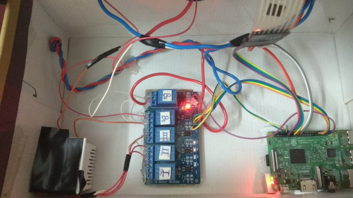|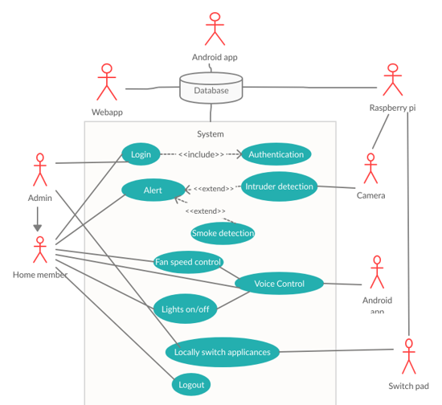|
|:--:|:--:|:--:|
|**About**|**Hardware Setup**|**UseCase**|

|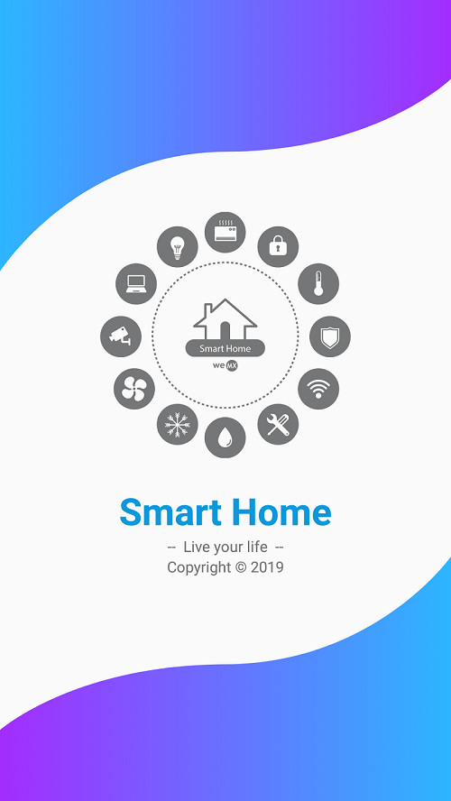|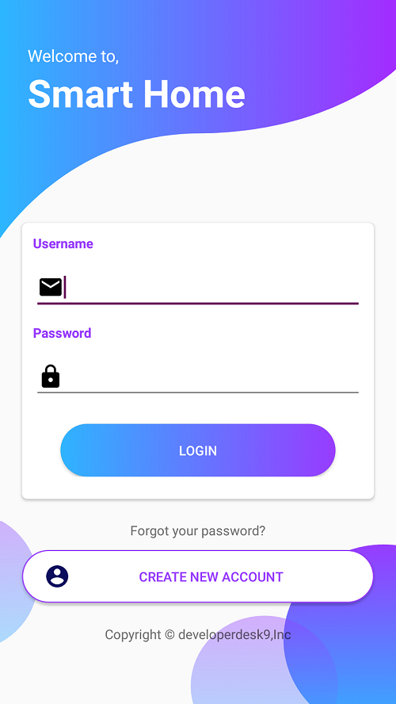|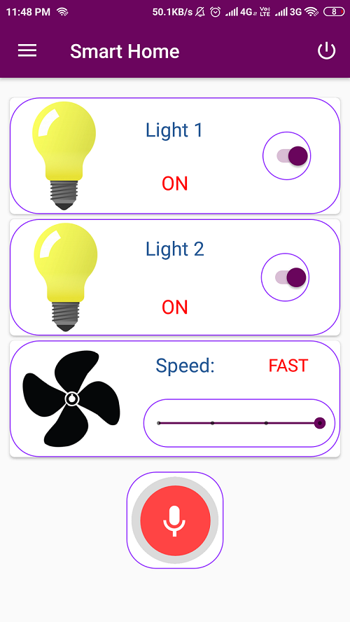|
|:--:|:--:|:--:|
|**App Screen1**|**App Screen2**|**App Screen3**|

## Tools Used
* [Android Studio](https://developer.android.com/studio) : Used as the Android developement environment.
* [Firebase Realtime Database](https://firebase.google.com/products/realtime-database) : Used as the backend database.
* [Firebase Storage](https://firebase.google.com/products/storage) : Use to store product Image
* [Firebase Authentication](https://firebase.google.com/products/auth) : Used to manage User information
* [Tensorflow](https://www.tensorflow.org/) : Used as the Deep Learning Library.
* [SK Learn](https://scikit-learn.org/) : For Data Preprocessing & Results.

## Future Possibilities and Extension of this project
- Biometric System Integration.
- Guest Interaction System.
- Distributed System for scalability.

## Contributing
You are welcome to contribute :

1. Fork it (https://github.com/roysaurabh1308/Smart-Home-Web-Version-1.0/fork)
2. Create new branch : `git checkout -b new_feature`
3. Commit your changes : `git commit -am 'Added new_feature'`
4. Push to the branch : `git push origin new_feature`
5. Submit a pull request !

## Author 
**Thanks for going through this Repository! Have a nice day.** 
**Have any querry? Feel free to contact me.** 
 **Saurabh Roy** 
#### **Contact** :`roysaurabh1308@gmail.com`

## License
This Project is licensed under the MIT License, see the [LICENSE](LICENSE) file for details.
 
 

